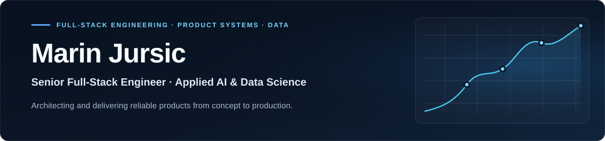

## Contact & freelance

I work with startups, founders, and product teams as a freelance senior engineer. If you need help shipping a full-stack product, building an AI or data workflow, improving an existing system, or taking a prototype to production, let's talk.

  

## Profile

I build production-grade software and applied AI systems from research and architecture through deployment and iteration. My work spans **full-stack product engineering, LLM and agent workflows, machine-learning experimentation, data science, interactive visualization, and developer infrastructure**.

I combine senior-level product ownership with hands-on technical depth—connecting model and data work to reliable APIs, polished interfaces, measurable evaluation, and production delivery.

### Core stack

**Focus:** AI-native product systems · LLM and agent workflows · fine-tuning and evaluation · embeddings and clustering · data-intensive applications
