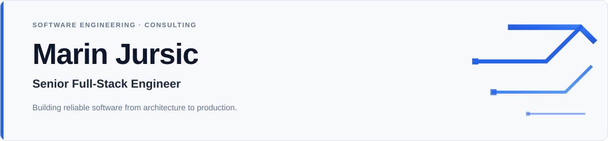

## Freelance & consulting

I partner with founders, product leaders, and engineering teams on technically demanding software and data-intensive product initiatives. Engagements range from architecture and technical direction to hands-on delivery of production platforms, applied AI workflows, and scalable systems.

  

## Profile

I build production-grade software systems from architecture through deployment and iteration. My work spans **full-stack product engineering, cloud-native platforms, API and data architecture, developer infrastructure, and applied AI and machine-learning workflows**.

I combine senior-level product ownership with hands-on technical depth—turning complex requirements into reliable APIs, polished interfaces, maintainable platforms, and measurable production outcomes.

### Core stack

**Focus:** Full-stack architecture · cloud and distributed systems · AI-enabled products · data-intensive applications · model evaluation
